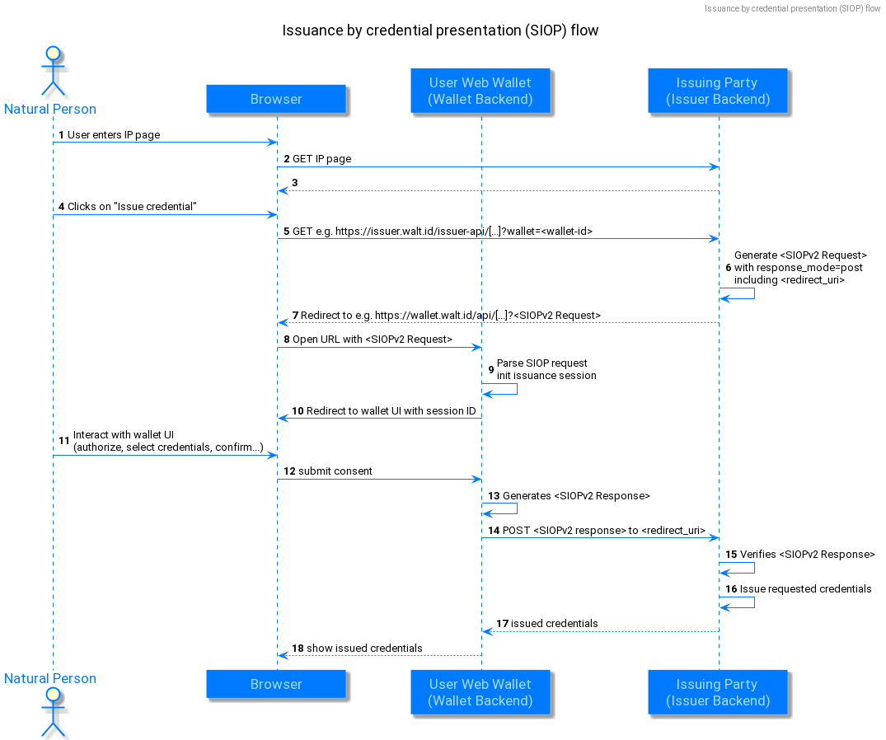

# Issuance via OIDC for Verifiable Presentations (SIOP)

The web wallet supports a custom issuance flow, that can be triggered from the issuer portal and makes use of the OIDC for verifiable presentations (SIOP) flow, to commute between issuer portal and wallet. The user starts at the issuer portal and selects the credentials they want to get issued. The issuer portal redirects to a, previously configured, known wallet, using the SIOP flow outlined above. The wallet creates the SIOP response, posts it to the issuer portal, and in return receives the issued credentials, given that the credential presentation was verified successfully:

