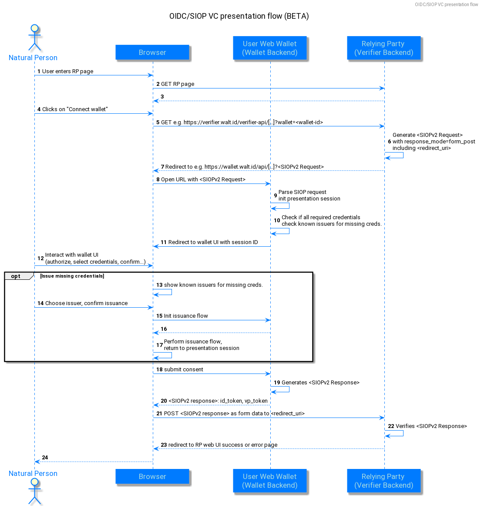

# OIDC - OpenID connect

The walt.id SSI wallet supports credential issuance and presentation via the OIDC standards

* [**OIDC for credential issuance**](https://tlodderstedt.github.io/openid-connect-4-verifiable-credential-issuance-1\_0-01.html)
* [**OIDC for verifiable presentations**](https://openid.net/specs/openid-connect-4-verifiable-presentations-1\_0.html)

Below you find sequence diagrams of the integrated end-to-end flows, for understanding:

## OIDC for credential issuance

The issuance flow is triggered from the wallet. The user chooses from a list of issuer portals known to the wallet backend, and triggers the issuance of any credential type the issuers support. Optionally, the issuer can require a verifiable presentation of certain types of credentials, to be sent with the initial authorization request. If the authorization is successful, the issuer portal provides an authorization code and access token, for the wallet to retrieve the issued credentials:

## OIDC for credential presentation (SIOP)

The verification flow is started from the verifier web portal. The verifier requires a certain type of credential to be presented, and let's the user connect to a previously configured, known wallet. 
The wallet, receiving the SIOP authorization request, can check if all required credentials are available, and optionally trigger a credential issuance flow for possibly missing credentials. If all required credentials are available the user selects the credentials to present (if multiple credentials of the same type are available) and the wallet generates the SIOP response, containing an id token and the verifiable presentation, and redirects back the verifier portal for verification:

## Issuance via OIDC for credential presentation (SIOP)

The web wallet supports a custom issuance flow, that can be triggered from the issuer portal and makes use of the OIDC for credential presentation (SIOP) flow, to commute between issuer portal and wallet.
The user starts at the issuer portal and selects the credentials they want to get issued. The issuer portal redirects to a, previously configured, known wallet, using the SIOP flow outlined above. The wallet creates the SIOP response, posts it to the issuer portal, and in return receives the issued credentials, given that the credential presentation was verified successfully:

