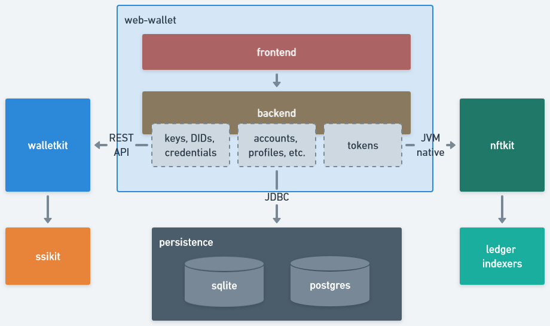

# Architecture

Web-wallet consists of 2 modules (both part of the same repository):
- **frontend** - customer facing
- **backend** - providing the required support for frontend, such as:
  - authentication (_walletkit_)
  - credential-related dependencies (_walletkit_)
  - token-related dependencies (_nftkit_)
  - storage (_RDBMS_)

