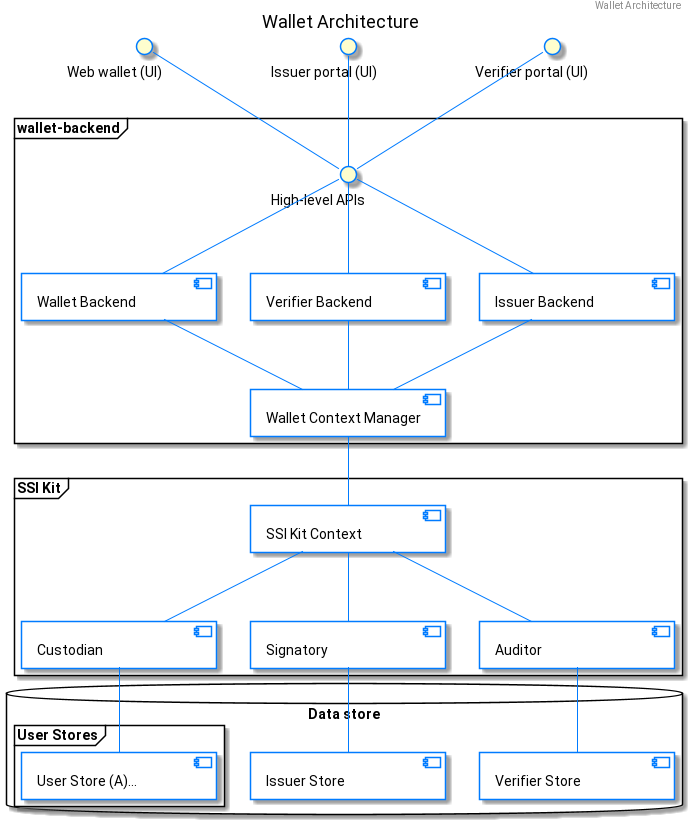

# Architecture

The wallet backend, as well as the issuer and verifier backends, are built as abstraction layers on top of the _walt.id SSI Kit_.

Based on the _SSI Kit_, the backends provide **user data separation** (user contexts of the underlying data stores) and **high-level APIs** for the interaction with the **web frontends** and the **credential exchange protocols** such as OIDC and SIOP.

The wallet backend can be seen as an abstraction over the Custodian component of the SSI Kit, whereas the issuer and verifier backends build on top of the Signatory and Auditor components, respectively.

